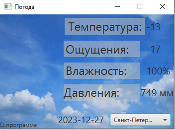

# Программа погода.
---

__Разработчик__: Gantsevich Alexey  
__Канал__: Chessplayer - IT Specialist  
__ПО__: IntelliJ IDEA, Scene Builder

---

### О проекте:  
Программа "_Погода_" была сделана при помощи программы IntelliJ IDEA и Scene Builder. Программа распространяется по лицензии __GPLv3__, она разрешает людям использовать и даже распространять модель без требования платить за это кому бы то ни было и использовать в коммерческих проектах. 

Вы можете его скачать и измениять его. Ппрограмма, созданная на основе программы «_Погода_», должна распространяться также на условиях GPL, она не может быть переведена на коммерческую лицензию модификаторами и прочими «третьими лицами». 

В проекте есть папка Applications где находится готовые программы, вы можете их установить и использовать:
- портативная программа

### Зачем нужен:  
Программа погод.

### Важно:
После скачивания проекта, нужно поменять имя файла с "readme.md" на "readme.txt".

### API: 
В проекте используется OpenWeatherMap API для получения данных в формате JSON. В проекте нет токена. 
В классе HttpsConnect есть реализация.

### Котакты: 
* Основной канал: [Chessplayer - IT Specialist](https://www.youtube.com/@chessplayeritspecialist)  
* Канал разработчика: [Alexey Gantsevich](https://www.youtube.com/channel/UCt7oE2_eelKlB88rXJ00jXg)
